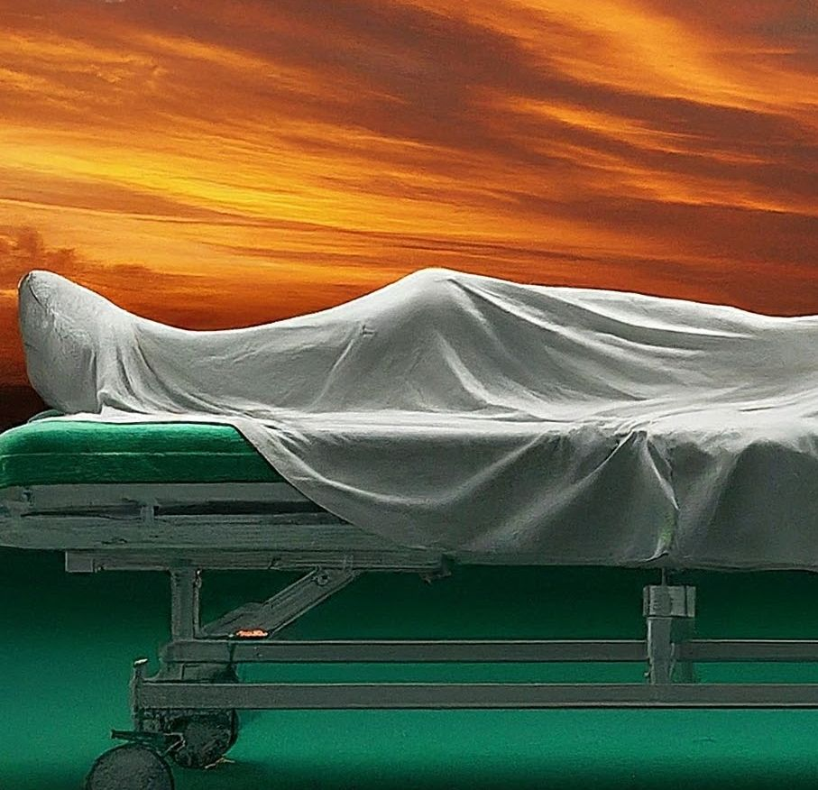

# Adhirstathaal

'Ungalku ponnu porandhurku sir, apdiye ungala madriye irukka'. Indha varthaigalai kettkum bodhu, Idhuvaraikum epdi vazhandheno theriyala, Ana inimel Bayathoda Vazha Vendum Ena purindhadhu. Ellarum "pen kozhandhai miga mukkiyam... kavanamaga pathuko" nu sonnanga.

Analum naan Nindren

School-ku kuda naane kootitu poven. Friends oda epdi irukkanum, veliya aalunga kitta epdi irukanum lam katthukuduthen. Velila situations seri illa, self defense kaagha martial arts training ku anupunen. Friends oda velila ponum nu sollum bodhellam eppovum vena nu sonadhilla. Avalukku Avala Epdi kaapathikanumo avaluku theriyum, adhunala dhairyama anupivaipan. Ellarum 'Ponna ipdi lam velila anupura, velila situations onnum seri illa' nu bayamburuthuvanga.

Analum naan Nindren 

College la Ava yaarayo kadhalicha vishayam avaluku munnadiye yaaro ennaku paathu sonnanga. Ellam sonadhuku aprom "Ponnuku ivalo freedom kudutha ipdi dhan irukum" nu sonna varthai ellam nenjula oosi kuthuna madri irundhuchu.

Analum naan Nindren

"Appa naan velaiku poren" nu ennaku sonna appo, Ellarmadriyum kalayanam panniko nu sollama, en sondha kaal la naa nippen nu en ponnu keta Appo perumaiya irundhuchu. Kitta irukuravanga "Ponnuku kalyanam panni vekkama, velaiku edhuku" nu kekumbodhu,

Ulagathirku edhira en ponnuku naan nindren.

Ana iniku ava phone la irundhu oru call vandhuchu. Pesunadhu ava illa. Ana vishayam avala pathi dhan. government hospital ku vara sonanga. vishayam ennanu sollala.

Bayandhen, Analum naan nindren.

Hospital ku ponen. Oru periya kootathai thaandi ponen. Andha kootathu naduvula tharaiyila irundha ava. Thala suthi vilundhurpa nu nenachen. Thalaila irundhu Rattham ozhuvudhu. Mogam Muzhuvadhum kayangala irundhuchu. Udambu mela siridhu alavu thuni kuda illa. Enakku onnum purila. Anga irukuradhu Ennoda ponna illama irundha nalla irukum nu thonichu. Ana ava en ponnu dhan nu ellarum sonanga.

Erandhuta nu sonnanga. Ipo ennala nirka kuda mudiyala.
Konnatanga nu sonnanga. Thaanga mudiyala.
Ana adhukulla yaaro "Ara goraya dress pottupa eppovum, vera enna aagum" nu pesikitanga.
Manasu odanji sarinjiten.
Mutti mela ninnu, mela paathu, andha kadavula keten.
"Ithana thevidiya passangala vitutu, ennoda ponna edhuku da konnuta" nu.
Kanna mooditu, yosichen. 

Thappu yaarudhu nu.

Yendhu dhan. Yennodadhu dhan.
"Unnaku payan venuma, ponnu venuma ?" nu en manaivi enna ketta appo, konjam kuda yosikama "Ponnu dhan venum", nu naan sonnadhuku, enna naan eppovum manikkamudiyadhu.
Enna mannichuru ma.

"Appa, Desiya kodi la vellai colour edhuku pa ? edhoda symbol ?" nu ava ketta appo,
"Namma desathula la irukura Amayithikkagha, nermaikkagha.." nu sonnen.
"unna madri ethanayo peru mela Pothina vellai thuni ki adayalam amma" nu sollirkanum

Ennoda naadu ennaku enna kuduthuchu ?
Pudicha Thuni pottadhuku, Mirukangalagha maariya Aan peygala ?
Indha naatukku sevai seiyvadharka, Ava oru doctor aana ?
Indha naatukku sevai seiyvadharka un ponnu padicha ?
Panamum, pugazhukkum thavira, dharmathukku paadhaiye illadha naadu ennodadhu.
Kaamathukkum, Saathaniyathaiyum kum thavira, kaadhal ku idam illadha naadu ennodadhu.
Pengal iravu nerathil dhairyamaagha nadukura naal engaloda naatukku unmaiyaana sudhandhiram nu sonnanga. nadukuraanga. ana adhu pudichu pannala, avangal la oruthar patta vedhanai ku atleat Nyayam kedikum nu.
Appoyavudhu Edhiri yaarunu theriyum. Avargal adayalam kaanakudiyavargal. 
Ippo...

En Thangachi, En Akka, En Amma, En manaivi, en ponnu nu nenikura oru oru Aanum veerane.
Ennaku samandha padala na, pengal illaya? manushanga illaya ?
**Sollunga...unnaku samandha padala na, manushanga illaya ?**

Nyabagam vechikonga, un ponnu oh thangachi oh akka oh iniku safe ah veetuku vandhutanga na, adhu unnoda valarpu naala illa, avangalku therinju self defense naala illa. Iniku avangaloda Adhirstham nalla irundhadhu naala mattume dhan.

Idhu en kadhai illa, un kadhai illa. Adhirstham illadha andha oru ponnoda kadhai um illa. Inikku Adhirshtathodu veetuku vandha, andha ponnoda Edhirgaala kadhai.
Bayandhu bayandhu valakkura andha appa oda kadhai.
"Habbada, na ponna porakala" nu nenikura oru oru Aanoda kadhai.

***Vaazhuradhuku Adhirshtam romba mukhiyam nu panna indha naatukku...
Iniya sudhandhira dhina Vazhthukkal.***

*August 15, 2024,
unnai pol edhuvum seiyamudiyamal irukum oru Indian,
Venu Pulagam*

*Translated to Tamil by,*

*Rakhil ML*